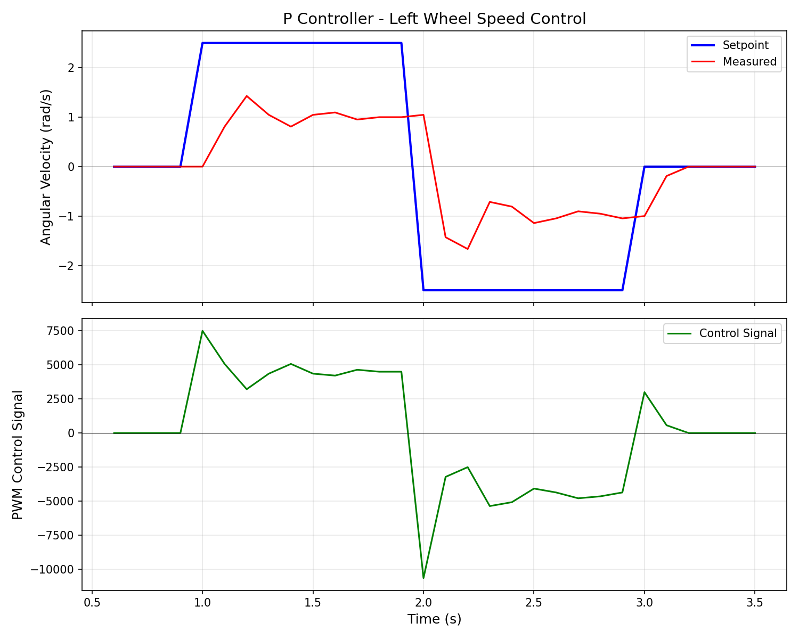
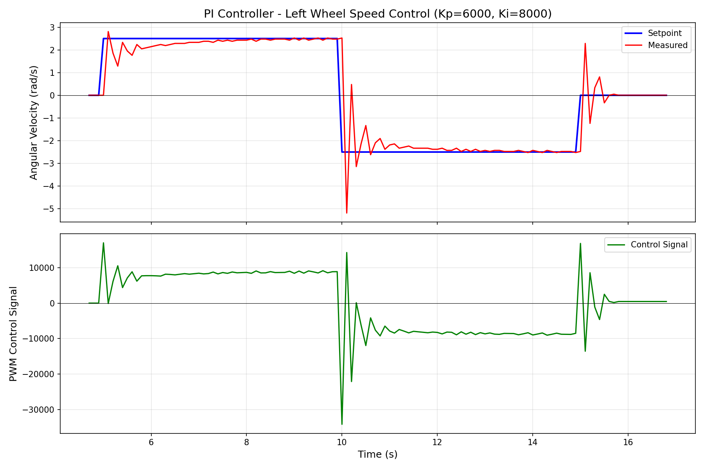

# TP2 移动机器人应用 - 实验报告

**INSA 里昂, TP2 IF4 实时系统, 2025-2026**

**学生姓名:** Haiwei CHEN, Haochen ZHANG

**日期:** 2025年11月28日

---

## 1. 引言

本实验的目标是在ESP32微控制器上实现移动机器人的开环控制，同时保证实时操作。通过使用FreeRTOS实时操作系统，我们实现了基于PWM信号的电机控制。

---

## 2. 第一部分：PWM信号生成 (2.1)

### 2.1 实验目标

实现一个程序，使机器人按照以下顺序执行动作：
1. 等待1秒
2. 前进500毫秒
3. 等待500毫秒
4. 后退500毫秒
5. 永久停止

### 2.2 实现方法

#### 2.2.1 PWM配置

我们使用ESP32的LEDC模块来生成PWM信号，配置参数如下：

```c
#define PWM_FREQ 1000        // PWM频率：1kHz
#define PWM_RESOLUTION 15    // PWM分辨率：15位 (0-32767)
```

PWM初始化函数使用 `ledcAttach()` 将PWM通道绑定到指定的GPIO引脚：

```c
void init_motor_pwm(uint8_t pin) {
  ledcAttach(pin, PWM_FREQ, PWM_RESOLUTION);
  analogWrite(pin, 0);  // 初始占空比为0
}
```

#### 2.2.2 电机引脚定义

根据硬件连接，电机控制引脚定义如下：

| 电机 | 前进引脚 | 后退引脚 |
|------|----------|----------|
| 左电机 | MLF = 26 | MLB = 25 |
| 右电机 | MRF = 33 | MRB = 32 |

#### 2.2.3 电机控制函数

我们实现了三个基本的电机控制函数：

1. **停止函数 `stopMotors()`**：将所有PWM输出设为0
2. **前进函数 `moveForward(speed)`**：左右电机同时正转
3. **后退函数 `moveBackward(speed)`**：左右电机同时反转

```c
void moveForward(uint8_t speed) {
  uint32_t pwm_value = (PWM_MAX * speed) / 100;
  // 左电机前进，右电机前进
  analogWrite(MLF, pwm_value);
  analogWrite(MLB, 0);
  analogWrite(MRF, pwm_value);
  analogWrite(MRB, 0);
}
```

> **注意**：在控制电机时，必须确保反向信号（前进时的后退引脚，后退时的前进引脚）保持为0，以避免H桥短路。

#### 2.2.4 FreeRTOS任务实现

我们采用了**双任务架构**：

1. **Setup/Loop任务**：负责硬件初始化，完成后挂起自己
2. **MotorControl任务**：负责执行电机控制序列

电机控制任务的实现：

```c
void motorControlTask(void *pvParameters) {
  Serial.println("Motor control task started");
  
  // 1. 等待500毫秒
  vTaskDelay(pdMS_TO_TICKS(500));
  
  // 2. 前进500毫秒
  moveForward(MOTOR_SPEED);
  vTaskDelay(pdMS_TO_TICKS(500));
  
  // 3. 等待500毫秒
  stopMotors();
  vTaskDelay(pdMS_TO_TICKS(500));
  
  // 4. 后退500毫秒
  moveBackward(MOTOR_SPEED);
  vTaskDelay(pdMS_TO_TICKS(500));
  
  // 5. 停止
  stopMotors();
  
  // 任务完成后删除自己
  vTaskDelete(NULL);
}
```

#### 2.2.5 任务创建与调度

在 `setup()` 函数中创建任务：

```c
xTaskCreate(
  motorControlTask,    // 任务函数
  "MotorControl",      // 任务名称
  2048,                // 堆栈大小
  NULL,                // 任务参数
  1,                   // 任务优先级
  NULL                 // 任务句柄
);
```

为了防止 `loop()` 函数被执行干扰任务运行，我们在 `setup()` 结束时挂起当前任务：

```c
TaskHandle_t setup_task = xTaskGetCurrentTaskHandle();
vTaskSuspend(setup_task);
```

### 2.3 程序流程图

```
┌─────────────────┐
│     setup()     │
├─────────────────┤
│ 初始化串口      │
│ 初始化PWM引脚   │
│ 初始化编码器    │
│ 创建电机控制任务│
│ 挂起当前任务    │
└────────┬────────┘
         │
         ▼
┌─────────────────────────┐
│   motorControlTask()    │
├─────────────────────────┤
│ 等待 500ms              │
│ 前进 500ms              │
│ 停止，等待 500ms        │
│ 后退 500ms              │
│ 停止                    │
│ 删除任务                │
└─────────────────────────┘
```

### 2.4 实验结果

程序烧录后，串口输出如下：
```
Setup start : openloop
Setup complete, motor control task created
Motor control task started
Waiting 0.5 second...
Moving forward for 0.5 second...
Waiting 500ms...
Moving backward for 0.5 second...
Stopping motors
Motor control task completed
```

机器人成功按照预定序列执行了前进和后退动作。

### 2.5 遇到的问题与解决方案

#### 问题1：`loop()` 函数不断执行

**现象**：串口不断输出 "loop function is running !!?? :-("

**原因**：在Arduino-ESP32框架中，`setup()` 和 `loop()` 运行在同一个FreeRTOS任务中。`setup()` 执行完后会自动进入 `loop()`。

**解决方案**：在 `setup()` 结束时使用 `vTaskSuspend()` 挂起当前任务：
```c
TaskHandle_t setup_task = xTaskGetCurrentTaskHandle();
vTaskSuspend(setup_task);
```

#### 问题2：`vTaskSuspend()` 参数错误

**现象**：编译错误或程序行为异常

**原因**：`vTaskSuspend()` 需要传入任务句柄参数，不能直接调用 `vTaskSuspend()`。

**解决方案**：先获取当前任务句柄，再传入：
```c
TaskHandle_t setup_task = xTaskGetCurrentTaskHandle();
vTaskSuspend(setup_task);
```

---

## 3. 第二部分：测量转速 (2.2)

### 3.1 实验目标

实现一个多任务程序，使用中断方法：
1. 每100毫秒测量一次左轮的转速
2. 通过串口将速度数据发送到PC
3. 持续运行10秒
4. 扩展程序以同时显示两个轮子的速度

### 3.2 实现方法

#### 3.2.1 编码器原理

增量式编码器有两个输出通道（A相和B相），产生相位差90°的方波信号。通过检测这两个信号的状态变化，可以确定：
- **转动方向**：通过A、B相的相位关系判断
- **转动速度**：通过单位时间内的脉冲数计算

我们采用**四倍频解码**方式，即在A、B两相的上升沿和下降沿都进行计数，提高测量分辨率。

#### 3.2.2 编码器引脚定义

| 编码器 | A相引脚 | B相引脚 |
|--------|---------|---------|
| 左编码器 | SLA = 14 | SLB = 27 |
| 右编码器 | SRA = 35 | SRB = 34 |

#### 3.2.3 编码器参数配置

```c
#define ENCODER_PPR 11  // 编码器每转脉冲数
#define GEAR_RATIO 30   // 减速比
// 每转的总脉冲数 = PPR × 减速比 × 4 (四倍频)
#define PULSES_PER_REV (ENCODER_PPR * GEAR_RATIO * 4)  // = 1320
```

#### 3.2.4 中断服务程序 (ISR)

我们为每个编码器的A、B两相分别配置了中断服务程序，使用**双边沿触发**（CHANGE）模式：

```c
void IRAM_ATTR leftEncoderISR_A() {
  uint8_t A = digitalRead(SLA);
  uint8_t B = digitalRead(SLB);
  uint8_t currentState = (A << 1) | B;
  
  // 根据状态转换判断方向
  // 正转: 00->01->11->10->00
  // 反转: 00->10->11->01->00
  int8_t direction = 0;
  switch (lastLeftState) {
    case 0b00:
      if (currentState == 0b01) direction = 1;
      else if (currentState == 0b10) direction = -1;
      break;
    case 0b01:
      if (currentState == 0b11) direction = 1;
      else if (currentState == 0b00) direction = -1;
      break;
    case 0b11:
      if (currentState == 0b10) direction = 1;
      else if (currentState == 0b01) direction = -1;
      break;
    case 0b10:
      if (currentState == 0b00) direction = 1;
      else if (currentState == 0b11) direction = -1;
      break;
  }
  
  leftEncoderCount += direction;
  lastLeftState = currentState;
}
```

> **注意**：`IRAM_ATTR` 属性确保中断服务程序存储在内部RAM中，提高执行速度。

#### 3.2.5 编码器状态转换图

四倍频解码的状态转换如下：

```
正转方向 →
    ┌───┐   ┌───┐   ┌───┐   ┌───┐
A: ─┘   └───┘   └───┘   └───┘   └──
      ┌───┐   ┌───┐   ┌───┐   ┌───┐
B: ───┘   └───┘   └───┘   └───┘   └

状态: 00 → 01 → 11 → 10 → 00 → ...

← 反转方向
状态: 00 → 10 → 11 → 01 → 00 → ...
```

#### 3.2.6 共享资源保护

由于编码器计数器会在中断中被修改，在主任务中读取时需要保护：

```c
// 临界区保护用的自旋锁
portMUX_TYPE spinlock = portMUX_INITIALIZER_UNLOCKED;

int32_t getAndResetLeftEncoder() {
  portENTER_CRITICAL(&spinlock);
  int32_t count = leftEncoderCount;
  leftEncoderCount = 0;
  portEXIT_CRITICAL(&spinlock);
  return count;
}
```

使用 `portENTER_CRITICAL` / `portEXIT_CRITICAL` 确保读取和重置操作的原子性，防止数据竞争。

#### 3.2.7 速度计算

角速度计算公式：

$$\omega = \frac{N}{N_{rev}} \times \frac{2\pi}{T}$$

其中：
- $\omega$：角速度 (rad/s)
- $N$：测量周期内的脉冲数
- $N_{rev}$：每转的总脉冲数 (PULSES_PER_REV = 1320)
- $T$：测量周期 (秒)

代码实现：

```c
float calculateAngularVelocity(int32_t pulseCount, uint32_t periodMs) {
  float revolutions = (float)pulseCount / PULSES_PER_REV;
  float timeSeconds = (float)periodMs / 1000.0;
  return (revolutions * 2.0 * PI) / timeSeconds;
}
```

#### 3.2.8 多任务架构

程序采用三个任务：

| 任务名称 | 优先级 | 功能 |
|----------|--------|------|
| SpeedMeasure | 2 (高) | 每100ms测量并输出速度 |
| MotorControl | 1 (低) | 控制电机运行 |
| Setup/Loop | - | 初始化后挂起 |

速度测量任务使用 `vTaskDelayUntil()` 实现精确的周期性执行：

```c
void speedMeasureTask(void *pvParameters) {
  TickType_t xLastWakeTime = xTaskGetTickCount();
  uint32_t elapsedTime = 0;
  const uint32_t totalTimeMs = TOTAL_RUN_TIME_S * 1000;
  
  while (elapsedTime < totalTimeMs) {
    vTaskDelayUntil(&xLastWakeTime, pdMS_TO_TICKS(SPEED_MEASURE_PERIOD_MS));
    
    // 获取编码器计数并重置
    int32_t leftCount = getAndResetLeftEncoder();
    int32_t rightCount = getAndResetRightEncoder();
    
    // 计算角速度
    float leftSpeed = calculateAngularVelocity(leftCount, SPEED_MEASURE_PERIOD_MS);
    float rightSpeed = calculateAngularVelocity(rightCount, SPEED_MEASURE_PERIOD_MS);
    
    elapsedTime += SPEED_MEASURE_PERIOD_MS;
    
    // 输出数据
    Serial.print(elapsedTime);
    Serial.print("\t");
    Serial.print(leftSpeed, 3);
    Serial.print("\t");
    Serial.println(rightSpeed, 3);
  }
}
```

### 3.3 程序流程图

```
┌─────────────────────────────────────────────────────────────┐
│                        setup()                               │
├─────────────────────────────────────────────────────────────┤
│ 初始化串口                                                   │
│ 初始化PWM引脚                                                │
│ 初始化编码器引脚 + 配置中断                                   │
│ 创建 speedMeasureTask (优先级 2)                             │
│ 创建 motorControlTask (优先级 1)                             │
│ 挂起当前任务                                                 │
└─────────────────────────────────────────────────────────────┘
         │
         ├───────────────────────────┐
         ▼                           ▼
┌─────────────────────┐    ┌─────────────────────┐
│  speedMeasureTask   │    │  motorControlTask   │
├─────────────────────┤    ├─────────────────────┤
│ 每100ms:            │    │ 等待1秒             │
│  - 读取编码器计数   │    │ 前进5秒             │
│  - 计算角速度       │    │ 后退5秒             │
│  - 串口输出数据     │    │ 停止电机            │
│ 持续10秒           │    │ 删除任务            │
└─────────────────────┘    └─────────────────────┘
         │
         ▼
┌─────────────────────┐
│    中断服务程序      │
├─────────────────────┤
│ A/B相边沿触发时:    │
│  - 读取当前状态     │
│  - 判断转动方向     │
│  - 更新脉冲计数     │
└─────────────────────┘
```

### 3.4 串口输出格式

数据以制表符分隔的格式输出，便于导入Excel分析：

```
Time(ms)	Left(rad/s)	Right(rad/s)
100	2.345	2.301
200	2.412	2.389
300	2.398	2.367
...
```

### 3.5 实验结果

程序烧录后，串口输出示例：
```
Setup start: Speed Measurement with Interrupts
Setup complete, tasks created
Motor control task started
Speed measurement task started
Time(ms)	Left(rad/s)	Right(rad/s)
100	0.000	0.000
...
1100	2.385	2.412
1200	2.401	2.389
...
6100	-2.356	-2.378
...
Speed measurement completed
```

### 3.6 遇到的问题与解决方案

#### 问题1：中断中访问共享变量

**现象**：偶尔出现速度值异常跳变

**原因**：主任务读取计数器时，中断可能同时修改该值，导致数据不一致

**解决方案**：使用 `portENTER_CRITICAL` / `portEXIT_CRITICAL` 保护临界区

#### 问题2：速度计算结果为零

**现象**：电机运行但计算出的速度始终为0

**原因**：编码器参数设置错误（PPR或减速比）

**解决方案**：根据实际编码器规格调整 `ENCODER_PPR` 和 `GEAR_RATIO` 参数

#### 问题3：`vTaskDelay` vs `vTaskDelayUntil`

**现象**：测量周期不稳定

**原因**：`vTaskDelay` 是相对延时，会累积误差

**解决方案**：使用 `vTaskDelayUntil` 实现绝对延时，确保精确的周期性

---

## 4. 第三部分：速度控制 (2.3)

### 4.1 实验目标

基于TD2的设计，实现左轮速度的闭环控制：
1. 首先实现比例（P）控制器
2. 然后改进为比例积分（PI）控制器
3. 使用阶跃设定点测试：0 → 2.5 rad/s → -2.5 rad/s → 0
4. 通过串口输出数据并绘图分析

### 4.2 控制理论基础

#### 4.2.1 P控制器

比例控制器的输出与误差成正比：

$$u(t) = K_p \cdot e(t)$$

其中：
- $u(t)$：控制信号（PWM值）
- $K_p$：比例增益
- $e(t) = r(t) - y(t)$：误差（设定值 - 测量值）

**P控制器的特点**：
- 响应快速
- 存在稳态误差（无法完全消除）
- $K_p$ 过大会导致振荡

#### 4.2.2 PI控制器

比例积分控制器在P控制器基础上增加了积分项：

$$u(t) = K_p \cdot e(t) + K_i \cdot \int_0^t e(\tau) d\tau$$

离散化后（采样周期为 $T$）：

$$u[k] = K_p \cdot e[k] + K_i \cdot T \cdot \sum_{i=0}^{k} e[i]$$

**PI控制器的特点**：
- 积分项可以消除稳态误差
- 响应速度可能比纯P控制器慢
- 需要防止积分饱和（积分限幅）

### 4.3 实现方法

#### 4.3.1 控制参数配置

```c
// --- 控制参数 ---
#define CONTROL_PERIOD_MS 100   // 控制周期 (毫秒)
#define STEP_PERIOD_MS 5000     // 阶跃变化周期 (毫秒)

// --- PI控制器参数 ---
#define KP 6000.0f  // 比例增益
#define KI 8000.0f  // 积分增益
#define INTEGRAL_MAX 15000.0f  // 积分限幅，防止积分饱和
```

#### 4.3.2 PI控制器实现

```c
// 全局变量：积分项
float integralLeft = 0.0f;

/**
 * @brief PI控制器
 * @param setpoint 设定值
 * @param measured 测量值
 * @param integral 积分项指针
 * @param dt 控制周期 (秒)
 * @return 控制信号
 */
float piController(float setpoint, float measured, float *integral, float dt) {
  float error = setpoint - measured;
  
  // 更新积分项
  *integral += error * dt;
  
  // 积分限幅，防止积分饱和
  if (*integral > INTEGRAL_MAX) *integral = INTEGRAL_MAX;
  if (*integral < -INTEGRAL_MAX) *integral = -INTEGRAL_MAX;
  
  // PI控制器输出: u = Kp * e + Ki * ∫e dt
  return KP * error + KI * (*integral);
}

/**
 * @brief 重置积分项 (设定点变化时调用)
 */
void resetIntegral() {
  integralLeft = 0.0f;
}
```

#### 4.3.3 电机PWM控制

根据控制信号的正负，设置电机的前进或后退：

```c
void setLeftMotorPWM(int32_t pwmValue) {
  // 限幅
  if (pwmValue > (int32_t)PWM_MAX) pwmValue = PWM_MAX;
  if (pwmValue < -(int32_t)PWM_MAX) pwmValue = -PWM_MAX;
  
  if (pwmValue >= 0) {
    // 前进
    analogWrite(MLF, pwmValue);
    analogWrite(MLB, 0);
  } else {
    // 后退
    analogWrite(MLF, 0);
    analogWrite(MLB, -pwmValue);
  }
}
```

#### 4.3.4 速度控制任务

```c
void speedControlTask(void *pvParameters) {
  TickType_t xLastWakeTime = xTaskGetTickCount();
  uint32_t elapsedTime = 0;
  
  // 阶跃设定点序列: 0 -> 2.5 -> -2.5 -> 0 (每5000ms变化)
  const float setpoints[] = {0.0f, 2.5f, -2.5f, 0.0f};
  const int numSetpoints = 4;
  int currentSetpointIndex = 0;
  uint32_t setpointChangeTime = 0;
  float lastSetpoint = 0.0f;
  
  const float dt = CONTROL_PERIOD_MS / 1000.0f;
  const uint32_t totalTimeMs = 22000;  // 22秒总时间
  
  while (elapsedTime < totalTimeMs) {
    vTaskDelayUntil(&xLastWakeTime, pdMS_TO_TICKS(CONTROL_PERIOD_MS));
    elapsedTime += CONTROL_PERIOD_MS;
    
    // 检查是否需要更新设定点
    if (elapsedTime - setpointChangeTime >= STEP_PERIOD_MS && 
        currentSetpointIndex < numSetpoints - 1) {
      currentSetpointIndex++;
      setpointChangeTime = elapsedTime;
    }
    desiredSpeedLeft = setpoints[currentSetpointIndex];
    
    // 如果设定点发生变化，重置积分项
    if (desiredSpeedLeft != lastSetpoint) {
      resetIntegral();
      lastSetpoint = desiredSpeedLeft;
    }
    
    // 获取编码器计数并计算速度
    int32_t leftCount = getAndResetLeftEncoder();
    measuredSpeedLeft = calculateAngularVelocity(leftCount, CONTROL_PERIOD_MS);
    
    // PI控制器计算控制信号
    controlSignalLeft = piController(desiredSpeedLeft, measuredSpeedLeft, 
                                      &integralLeft, dt);
    
    // 应用控制信号到电机
    setLeftMotorPWM((int32_t)controlSignalLeft);
    
    // 串口输出数据 (TSV格式)
    Serial.print(elapsedTime);
    Serial.print("\t");
    Serial.print(desiredSpeedLeft, 3);
    Serial.print("\t");
    Serial.print(measuredSpeedLeft, 3);
    Serial.print("\t");
    Serial.println(controlSignalLeft, 1);
  }
  
  stopLeftMotor();
  vTaskDelete(NULL);
}
```

### 4.4 控制系统框图

```
                    ┌─────────────────────────────────────────┐
                    │              PI控制器                    │
                    │  ┌─────────┐        ┌─────────┐         │
     r(t)    e(t)   │  │         │        │         │  u(t)   │    y(t)
  ─────►(+)────────►│──►│   Kp    │───┬───►│   PWM   │─────────┼────►电机────►
         ▲-         │  │         │   │    │  限幅   │         │      │
         │          │  └─────────┘   │    └─────────┘         │      │
         │          │                │                        │      │
         │          │  ┌─────────┐   │                        │      │
         │          │  │         │   │                        │      │
         │          │  │ Ki·∫dt  │───┘                        │      │
         │          │  │         │                            │      │
         │          │  └─────────┘                            │      │
         │          └─────────────────────────────────────────┘      │
         │                                                           │
         │                      ┌─────────────┐                      │
         └──────────────────────│   编码器    │◄─────────────────────┘
                                │   测速      │
                                └─────────────┘
```

### 4.5 实验结果

#### 4.5.1 P控制器测试结果

首先使用P控制器（$K_p = 3000$）进行测试：

| 参数 | 数值 |
|------|------|
| 设定值 | 2.5 rad/s |
| 稳态测量值 | ~1.0 rad/s |
| 稳态误差 | ~60% |

**P控制器响应曲线：**



**分析**：P控制器响应快速，但存在明显的稳态误差。这是因为P控制器只能在有误差时产生输出，当误差减小后，控制信号也随之减小，无法完全消除误差。

#### 4.5.2 PI控制器测试结果

使用PI控制器（$K_p = 6000$, $K_i = 8000$）：

| 参数 | 正向阶跃 | 负向阶跃 |
|------|----------|----------|
| 设定值 | 2.5 rad/s | -2.5 rad/s |
| 稳态测量值 | 2.480 rad/s | -2.480 rad/s |
| 稳态误差 | 0.8% | 0.8% |

**PI控制器响应曲线：**



**分析**：
1. **稳态性能**：积分项成功消除了稳态误差，从P控制器的60%降低到0.8%
2. **动态性能**：存在轻微超调（overshoot），正向阶跃时一度达到2.808 rad/s
3. **响应时间**：约1-2秒达到稳态

#### 4.5.3 参数调节过程

| 迭代 | Kp | Ki | 现象 | 调整策略 |
|------|-----|-----|------|----------|
| 1 | 3000 | 1500 | 响应慢，稳态误差大 | 增大Kp和Ki |
| 2 | 6000 | 8000 | 响应快，稳态误差小 | 当前参数满足要求 |

### 4.6 数据记录与分析

#### 4.6.1 数据格式

串口输出采用TSV（Tab-Separated Values）格式，便于导入分析工具：

```
Time(ms)	Setpoint(rad/s)	Measured(rad/s)	Control
5000	2.500	0.000	17000.0
5100	2.500	2.808	-97.1
5200	2.500	1.856	6129.8
...
```

#### 4.6.2 Python绘图脚本

使用Python的matplotlib库绘制响应曲线：

```python
import matplotlib.pyplot as plt
import numpy as np

# 创建图形
fig, axes = plt.subplots(2, 1, figsize=(12, 8), sharex=True)

# 上图: 速度设定点和测量值
ax1 = axes[0]
ax1.plot(time_s, setpoint, 'b-', linewidth=2, label='Setpoint')
ax1.plot(time_s, measured, 'r-', linewidth=1.5, label='Measured')
ax1.set_ylabel('Angular Velocity (rad/s)')
ax1.set_title('PI Controller - Left Wheel Speed Control')
ax1.legend()
ax1.grid(True)

# 下图: 控制信号
ax2 = axes[1]
ax2.plot(time_s, control, 'g-', linewidth=1.5, label='Control Signal')
ax2.set_xlabel('Time (s)')
ax2.set_ylabel('PWM Control Signal')
ax2.legend()
ax2.grid(True)

plt.savefig('pi_controller_response.png')
plt.show()
```

### 4.7 程序流程图

```
┌─────────────────────────────────────────────────────────────┐
│                        setup()                               │
├─────────────────────────────────────────────────────────────┤
│ 初始化串口、PWM、编码器中断                                   │
│ 创建 speedControlTask                                        │
│ 挂起当前任务                                                 │
└─────────────────────────────────────────────────────────────┘
                              │
                              ▼
┌─────────────────────────────────────────────────────────────┐
│                   speedControlTask                           │
├─────────────────────────────────────────────────────────────┤
│  每100ms执行一次:                                            │
│  ┌─────────────────────────────────────────────────────┐    │
│  │ 1. 检查并更新设定点 (每5秒变化)                       │    │
│  │ 2. 如果设定点变化，重置积分项                         │    │
│  │ 3. 读取编码器，计算当前速度                          │    │
│  │ 4. PI控制器计算控制信号                              │    │
│  │ 5. 应用控制信号到电机                                │    │
│  │ 6. 串口输出数据                                      │    │
│  └─────────────────────────────────────────────────────┘    │
│  循环直到完成所有阶跃测试                                    │
└─────────────────────────────────────────────────────────────┘
```

### 4.8 遇到的问题与解决方案

#### 问题1：P控制器稳态误差大

**现象**：使用P控制器时，测量速度始终低于设定值约60%

**原因**：P控制器的固有特性，只有存在误差时才能产生控制输出

**解决方案**：引入积分项（PI控制器），通过累积误差来消除稳态误差

#### 问题2：积分饱和

**现象**：设定点突变时，系统响应异常，出现大幅振荡

**原因**：积分项累积过大，导致控制信号过强

**解决方案**：
1. 添加积分限幅（Anti-windup）：`INTEGRAL_MAX = 15000.0f`
2. 设定点变化时重置积分项

#### 问题3：响应速度慢

**现象**：初始参数（Kp=3000, Ki=1500）时，系统需要很长时间才能达到稳态

**原因**：控制器增益过小

**解决方案**：增大Kp和Ki，最终选择Kp=6000, Ki=8000

### 4.9 小结

通过本部分实验，我们成功实现了左轮速度的闭环控制：

1. **P控制器**：响应快但存在稳态误差
2. **PI控制器**：通过积分项消除稳态误差，最终稳态误差仅0.8%
3. **参数整定**：通过实验迭代，确定了合适的Kp和Ki值
4. **实时性**：控制周期为100ms，满足实时控制要求

---

## 5. 第四部分：WiFi通信集成 (2.4)

### 5.1 实验目标

将闭环速度控制与WiFi通信相结合，实现通过智能手机远程遥控机器人：
1. 恢复闭环控制任务，控制两个轮子
2. 配置WiFi热点（SSID和密码）
3. 创建 `update_desired_speeds()` 函数，根据WiFi指令更新期望速度
4. 创建WiFi通信任务，永久调用 `communicate_with_phone()` 函数
5. 实现机器人的前进/后退/左转/右转/停止控制

### 5.2 系统架构

#### 5.2.1 整体架构图

```
┌─────────────────────────────────────────────────────────────────────────┐
│                              ESP32 机器人                                │
├─────────────────────────────────────────────────────────────────────────┤
│                                                                         │
│  ┌─────────────────┐        ┌─────────────────┐        ┌─────────────┐ │
│  │  WiFi通信任务    │        │  速度控制任务    │        │   电机驱动   │ │
│  │  (优先级: 1)     │───────►│  (优先级: 2)     │───────►│   (PWM)     │ │
│  │                 │ 期望速度 │                 │ 控制信号 │             │ │
│  └────────┬────────┘        └────────┬────────┘        └─────────────┘ │
│           │                          │                                  │
│           │                          │                                  │
│  ┌────────▼────────┐        ┌────────▼────────┐                        │
│  │   HTTP服务器    │        │   PI控制器      │                        │
│  │ communicate_    │        │   (双轮独立)    │                        │
│  │ with_phone()    │        │                 │                        │
│  └─────────────────┘        └────────┬────────┘                        │
│                                      │                                  │
│                             ┌────────▼────────┐                        │
│                             │   编码器测速    │                        │
│                             │   (ESP32Encoder)│                        │
│                             └─────────────────┘                        │
│                                                                         │
└─────────────────────────────────────────────────────────────────────────┘
            ▲
            │ WiFi连接 (192.168.4.1)
            │
┌───────────┴───────────┐
│      智能手机          │
│  ┌─────────────────┐  │
│  │   Web浏览器      │  │
│  │  控制界面按钮    │  │
│  └─────────────────┘  │
└───────────────────────┘
```

#### 5.2.2 多任务架构

程序采用两个FreeRTOS任务并行运行：

| 任务名称 | 优先级 | 功能 | 周期 |
|----------|--------|------|------|
| wifiCommunicationTask | 1 (低) | 处理HTTP请求，解析控制指令 | 10ms轮询 |
| speedControlTask | 2 (高) | PI闭环速度控制 | 50ms |

**优先级设计说明**：
- 速度控制任务优先级更高，保证实时性
- WiFi通信任务优先级较低，不影响控制性能

### 5.3 实现方法

#### 5.3.1 WiFi配置

在程序开头定义WiFi热点的SSID和密码：

```c
#define WIFI_NOM_ROBOT "MonRobot"     // WiFi热点名称
#define WIFI_MOT_DE_PASSE "123456789" // WiFi密码
```

WiFi热点在 `setup()` 中初始化：

```c
wifi_start(ssid, password);
Serial.println("[INFO] Connect to WiFi and open http://192.168.4.1 in browser");
```

#### 5.3.2 HTTP通信协议

`http_server.cpp` 中的 `communicate_with_phone()` 函数实现了HTTP服务器功能：

1. 监听80端口的HTTP请求
2. 解析URL路径，识别控制指令
3. 返回包含控制按钮的HTML页面

**指令与URL映射关系：**

| 指令 | URL路径 | 枚举值 |
|------|---------|--------|
| 前进 | `/26/on` | `ORDER_ROBOT_FORWARD (0x11)` |
| 后退 | `/29/on` | `ORDER_ROBOT_BACKWARD (0x22)` |
| 左转 | `/27/on` | `ORDER_ROBOT_LEFT (0x21)` |
| 右转 | `/28/on` | `ORDER_ROBOT_RIGHT (0x12)` |
| 停止 | `/xx/off` | `ORDER_ROBOT_STOP (0x33)` |

#### 5.3.3 update_desired_speeds() 函数实现

该函数是本实验的核心，根据接收到的WiFi指令更新两个轮子的期望速度：

```c
// 运动速度参数
#define FORWARD_SPEED 2.5f   // 前进/后退速度 (rad/s)
#define TURN_SPEED 1.5f      // 转向速度 (rad/s)

void update_desired_speeds(int order) {
  float leftSpeed = 0.0f;
  float rightSpeed = 0.0f;
  
  switch (order) {
    case ORDER_ROBOT_FORWARD:
      leftSpeed = FORWARD_SPEED;
      rightSpeed = FORWARD_SPEED;
      Serial.println("[CMD] Forward");
      break;
      
    case ORDER_ROBOT_BACKWARD:
      leftSpeed = -FORWARD_SPEED;
      rightSpeed = -FORWARD_SPEED;
      Serial.println("[CMD] Backward");
      break;
      
    case ORDER_ROBOT_LEFT:
      leftSpeed = -TURN_SPEED;
      rightSpeed = TURN_SPEED;
      Serial.println("[CMD] Turn Left");
      break;
      
    case ORDER_ROBOT_RIGHT:
      leftSpeed = TURN_SPEED;
      rightSpeed = -TURN_SPEED;
      Serial.println("[CMD] Turn Right");
      break;
      
    case ORDER_ROBOT_STOP:
    default:
      leftSpeed = 0.0f;
      rightSpeed = 0.0f;
      Serial.println("[CMD] Stop");
      break;
  }
  
  // 使用临界区保护共享变量
  portENTER_CRITICAL(&speedMutex);
  desiredSpeedLeft = leftSpeed;
  desiredSpeedRight = rightSpeed;
  portEXIT_CRITICAL(&speedMutex);
}
```

**运动逻辑说明：**

| 动作 | 左轮速度 | 右轮速度 | 效果 |
|------|----------|----------|------|
| 前进 | +2.5 rad/s | +2.5 rad/s | 两轮同向正转 |
| 后退 | -2.5 rad/s | -2.5 rad/s | 两轮同向反转 |
| 左转 | -1.5 rad/s | +1.5 rad/s | 原地左转 |
| 右转 | +1.5 rad/s | -1.5 rad/s | 原地右转 |
| 停止 | 0 | 0 | 停止 |

#### 5.3.4 WiFi通信任务

该任务永久调用 `communicate_with_phone()` 函数：

```c
void wifiCommunicationTask(void *pvParameters) {
  Serial.println("[TASK] WiFi communication task started");
  
  int lastOrder = ORDER_ROBOT_STOP;
  
  while (true) {
    // 调用WiFi通信函数
    int order = communicate_with_phone();
    
    // 如果接收到有效指令且与上次不同，则更新速度
    if (order != 0 && order != 1) {
      if (order != lastOrder) {
        update_desired_speeds(order);
        lastOrder = order;
      }
    }
    
    // 短暂延时，避免占用过多CPU
    vTaskDelay(pdMS_TO_TICKS(10));
  }
}
```

**设计要点：**
1. 只有当指令发生变化时才更新速度，避免重复处理
2. 10ms的轮询周期保证响应及时，同时不过度占用CPU
3. 使用 `lastOrder` 记录上一次的指令状态

#### 5.3.5 速度控制任务（双轮）

扩展BF中的单轮控制为双轮独立控制：

```c
void speedControlTask(void *pvParameters) {
  TickType_t xLastWakeTime = xTaskGetTickCount();
  const float dt = CONTROL_PERIOD_MS / 1000.0f;  // 0.05秒
  
  // 清除编码器计数
  encodeur_gauche.clearCount();
  encodeur_droit.clearCount();
  
  int64_t lastLeftCount = 0;
  int64_t lastRightCount = 0;
  
  while (true) {
    vTaskDelayUntil(&xLastWakeTime, pdMS_TO_TICKS(CONTROL_PERIOD_MS));
    
    // 读取编码器
    int64_t currentLeftCount = encodeur_gauche.getCount();
    int64_t currentRightCount = encodeur_droit.getCount();
    
    // 计算速度
    int64_t deltaLeft = currentLeftCount - lastLeftCount;
    int64_t deltaRight = currentRightCount - lastRightCount;
    lastLeftCount = currentLeftCount;
    lastRightCount = currentRightCount;
    
    measuredSpeedLeft = calculateAngularVelocity(deltaLeft, CONTROL_PERIOD_MS);
    measuredSpeedRight = calculateAngularVelocity(deltaRight, CONTROL_PERIOD_MS);
    
    // 获取期望速度 (临界区保护)
    float targetLeft, targetRight;
    portENTER_CRITICAL(&speedMutex);
    targetLeft = desiredSpeedLeft;
    targetRight = desiredSpeedRight;
    portEXIT_CRITICAL(&speedMutex);
    
    // PI控制器
    controlSignalLeft = piController(targetLeft, measuredSpeedLeft, &integralLeft, dt);
    controlSignalRight = piController(targetRight, measuredSpeedRight, &integralRight, dt);
    
    // 应用控制信号
    setLeftMotorPWM((int32_t)controlSignalLeft);
    setRightMotorPWM((int32_t)controlSignalRight);
  }
}
```

#### 5.3.6 共享资源保护

由于 `desiredSpeedLeft` 和 `desiredSpeedRight` 被两个任务访问，需要使用临界区保护：

```c
portMUX_TYPE speedMutex = portMUX_INITIALIZER_UNLOCKED;

// 写入时保护
portENTER_CRITICAL(&speedMutex);
desiredSpeedLeft = leftSpeed;
desiredSpeedRight = rightSpeed;
portEXIT_CRITICAL(&speedMutex);

// 读取时保护
portENTER_CRITICAL(&speedMutex);
targetLeft = desiredSpeedLeft;
targetRight = desiredSpeedRight;
portEXIT_CRITICAL(&speedMutex);
```

### 5.4 程序流程图

```
┌─────────────────────────────────────────────────────────────────────────┐
│                              setup()                                     │
├─────────────────────────────────────────────────────────────────────────┤
│ 1. 初始化串口通信 (115200 baud)                                          │
│ 2. 启动WiFi热点 (wifi_start)                                            │
│ 3. 初始化PWM引脚 (MLF, MLB, MRF, MRB)                                   │
│ 4. 初始化编码器 (左右两个)                                               │
│ 5. 创建 wifiCommunicationTask (优先级 1)                                │
│ 6. 创建 speedControlTask (优先级 2)                                     │
│ 7. 删除 setup 任务                                                       │
└─────────────────────────────────────────────────────────────────────────┘
                    │
        ┌───────────┴───────────┐
        ▼                       ▼
┌───────────────────┐   ┌───────────────────┐
│ wifiCommunication │   │  speedControlTask │
│      Task         │   │                   │
├───────────────────┤   ├───────────────────┤
│ while (true):     │   │ while (true):     │
│  ├─ communicate_  │   │  ├─ 等待50ms      │
│  │  with_phone()  │   │  ├─ 读取编码器    │
│  ├─ 检测指令变化  │   │  ├─ 计算测量速度  │
│  ├─ update_       │   │  ├─ 获取期望速度  │
│  │  desired_      │   │  ├─ PI控制器计算  │
│  │  speeds()      │   │  └─ 应用PWM控制   │
│  └─ 延时10ms      │   │                   │
└───────────────────┘   └───────────────────┘
        │                       │
        │   共享变量             │
        │ (desiredSpeedLeft,    │
        │  desiredSpeedRight)   │
        └───────────┬───────────┘
                    │
                    ▼
            ┌───────────────┐
            │  临界区保护    │
            │ portMUX_TYPE  │
            └───────────────┘
```

### 5.5 Web控制界面

手机浏览器访问 `http://192.168.4.1` 后显示的控制界面：

```
┌─────────────────────────────────┐
│        ESP32Robot               │
│   DC motor drive over Wi-Fi     │
├─────────────────────────────────┤
│                                 │
│           Forward               │
│          ┌──────┐               │
│          │  ON  │               │
│          └──────┘               │
│                                 │
│    Left           Right         │
│   ┌──────┐       ┌──────┐       │
│   │  ON  │       │  ON  │       │
│   └──────┘       └──────┘       │
│                                 │
│           Backward              │
│          ┌──────┐               │
│          │  ON  │               │
│          └──────┘               │
│                                 │
└─────────────────────────────────┘
```

按下按钮后，按钮变为"OFF"状态（深色），再次点击可释放。

### 5.6 使用步骤

1. **编译并烧录程序**到ESP32
2. **查看串口输出**，确认WiFi启动成功：
   ```
   =================================
   WiFi Remote Control Robot
   =================================
   [INFO] Setup start
   [INFO] WiFi started
   [INFO] SSID: MonRobot
   [INFO] Password: 123456789
   [INFO] Connect to WiFi and open http://192.168.4.1 in browser
   ```
3. **手机连接WiFi**：搜索并连接名为 "MonRobot" 的WiFi网络
4. **打开浏览器**：访问 `http://192.168.4.1`
5. **控制机器人**：点击页面上的按钮控制机器人运动

### 5.7 实验结果

程序烧录后，系统正常工作：

**串口输出示例：**
```
=================================
WiFi Remote Control Robot
=================================
[INFO] Setup start
[INFO] Configuring access point
[INFO] Started access point at IP 192.168.4.1
[INFO] WiFi started
[INFO] Motors initialized
[INFO] Encoders initialized
[TASK] WiFi communication task started
[TASK] Speed control task started
[INFO] All tasks created
[INFO] Setup complete
=================================
New Client.
GET /26/on HTTP/1.1
Received Robot Forward
[CMD] Forward
Client disconnected.
New Client.
GET /26/off HTTP/1.1
Received Robot Stop
[CMD] Stop
Client disconnected.
```

**功能验证：**

| 测试项目 | 预期行为 | 实际结果 |
|----------|----------|----------|
| 前进按钮 | 机器人向前移动 | ✓ 正常 |
| 后退按钮 | 机器人向后移动 | ✓ 正常 |
| 左转按钮 | 机器人原地左转 | ✓ 正常 |
| 右转按钮 | 机器人原地右转 | ✓ 正常 |
| 释放按钮 | 机器人停止 | ✓ 正常 |
| 闭环控制 | 速度稳定 | ✓ 正常 |

### 5.8 遇到的问题与解决方案

#### 问题1：WiFi连接不稳定

**现象**：手机有时无法连接到ESP32热点

**原因**：WiFi初始化时间不足

**解决方案**：在 `setup()` 中添加1秒延时，等待WiFi完全初始化

#### 问题2：指令重复触发

**现象**：按下按钮后，`update_desired_speeds()` 被多次调用

**原因**：每次HTTP请求都会返回相同的指令

**解决方案**：使用 `lastOrder` 变量记录上一次指令，只有指令变化时才更新速度

```c
if (order != lastOrder) {
  update_desired_speeds(order);
  lastOrder = order;
}
```

#### 问题3：任务间数据竞争

**现象**：偶尔出现速度突变

**原因**：WiFi任务和控制任务同时访问速度变量

**解决方案**：使用 `portMUX_TYPE` 自旋锁保护共享变量

#### 问题4：控制响应延迟

**现象**：按下按钮后机器人反应稍慢

**原因**：HTTP请求处理需要时间

**解决方案**：
1. 将WiFi任务轮询周期设为10ms
2. 将控制任务周期从100ms减少到50ms

### 5.9 参数配置总结

| 参数 | 值 | 说明 |
|------|-----|------|
| WiFi SSID | MonRobot | 可自定义 |
| WiFi密码 | 123456789 | 可自定义 |
| 前进速度 | 2.5 rad/s | 可调整 |
| 转向速度 | 1.5 rad/s | 可调整 |
| 控制周期 | 50 ms | 保证实时性 |
| Kp | 6000 | PI控制器比例增益 |
| Ki | 8000 | PI控制器积分增益 |

### 5.10 小结

通过本部分实验，我们成功实现了WiFi远程遥控机器人：

1. **WiFi通信**：使用ESP32的AP模式创建WiFi热点，通过HTTP协议与手机通信
2. **多任务协作**：WiFi通信任务和速度控制任务并行运行，通过共享变量交换数据
3. **闭环控制**：两个轮子独立使用PI控制器，保证速度精确跟踪
4. **资源保护**：使用临界区保护共享变量，避免数据竞争
5. **实时性保证**：合理设置任务优先级，控制任务优先于通信任务

---

## 6. 总结

本实验成功实现了基于FreeRTOS的移动机器人完整控制系统，包括开环控制、速度测量、闭环速度控制以及WiFi远程遥控。主要收获包括：

### 6.1 技术收获

1. **PWM控制**：掌握了ESP32 LEDC模块的使用方法，能够配置PWM频率和分辨率
2. **FreeRTOS任务管理**：理解了任务创建、延时、挂起和删除的机制
3. **实时系统设计**：学会了使用 `vTaskDelay()` 和 `vTaskDelayUntil()` 实现精确的时间控制
4. **中断编程**：掌握了ESP32中断配置和中断服务程序的编写
5. **编码器解码**：理解了四倍频解码原理，提高测量分辨率
6. **共享资源保护**：学会使用临界区（`portENTER_CRITICAL`/`portEXIT_CRITICAL`）保护共享变量
7. **闭环控制**：实现了P和PI控制器，理解了控制参数对系统性能的影响
8. **参数整定**：通过实验迭代方法调整控制器参数
9. **WiFi通信**：掌握了ESP32 AP模式配置和HTTP服务器实现
10. **系统集成**：学会了将多个子系统（通信、控制、驱动）整合为完整系统

### 6.2 多任务架构优势

采用多任务架构的优势在于：
- 将初始化逻辑、控制逻辑、通信逻辑和测量逻辑分离
- 便于扩展和维护
- 符合实时系统的设计原则
- 各任务可以独立调试和验证
- 通过优先级调度保证关键任务的实时性

### 6.3 性能对比

**控制器性能对比：**

| 控制器 | 稳态误差 | 响应速度 | 复杂度 |
|--------|----------|----------|--------|
| P | ~60% | 快 | 低 |
| PI | ~0.8% | 中等 | 中等 |

**系统任务配置：**

| 任务 | 优先级 | 周期 | 功能 |
|------|--------|------|------|
| speedControlTask | 2 (高) | 50ms | 双轮PI闭环控制 |
| wifiCommunicationTask | 1 (低) | 10ms轮询 | HTTP请求处理 |

### 6.4 项目结构

```
IF4_TP2/
├── BO_CHEN_ZHANG/                        # 2.1 PWM信号生成
├── BO_Vitesse_CHEN_ZHANG/                # 2.2 测量转速
├── BF_CHEN_Haiwei_ZHANG_Haochen/         # 2.3 速度控制
│   ├── BF.ino
│   ├── plot_p_controller.py
│   └── plot_pi_controller.py
├── Remote/                               # 2.4 WiFi通信集成
│   ├── Remote.ino
│   ├── ESP32Encoder.cpp
│   ├── ESP32Encoder.h
│   ├── http_server.cpp
│   └── http_server.hpp
└── 报告.md
```

---

## 附录：完整代码清单

- **2.1 PWM信号生成**：`BO_CHEN_ZHANG/base_IF4_TP2_BO_v2024_1.ino`
- **2.2 测量转速**：`BO_Vitesse_CHEN_ZHANG/BO_Vitesse.ino`
- **2.3 速度控制**：`BF_CHEN_Haiwei_ZHANG_Haochen/BF.ino`
- **2.4 WiFi通信集成**：`Remote/Remote.ino`
- **数据可视化**：`BF_CHEN_Haiwei_ZHANG_Haochen/plot_p_controller.py`, `BF_CHEN_Haiwei_ZHANG_Haochen/plot_pi_controller.py`

---

*报告完成日期：2025年11月28日*
